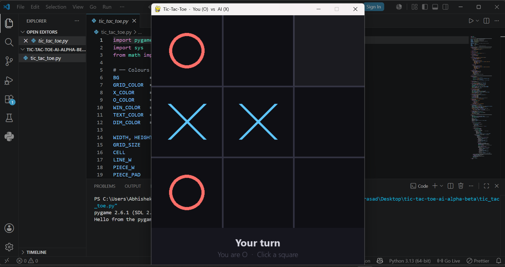

# Tic-Tac-Toe AI using Minimax & Alpha-Beta Pruning

An unbeatable Tic-Tac-Toe AI built using Python and Pygame.

The AI uses the Minimax algorithm with Alpha-Beta pruning to evaluate game states and choose the optimal move every time.

## Features

- Minimax Algorithm
- Alpha-Beta Pruning
- Interactive Pygame GUI
- Hover Effects
- Win Detection
- Restart Functionality
- Unbeatable AI Opponent

## Concepts Used

- Recursion
- Backtracking
- Game Trees
- Adversarial Search
- Minimax Algorithm
- Alpha-Beta Pruning
- GUI Development with Pygame

## Installation

```bash
pip install pygame
python tic_tac_toe.py
```

## Screenshot



## Future Improvements

- Difficulty Levels
- Sound Effects
- Animated Transitions
- Score Tracking
